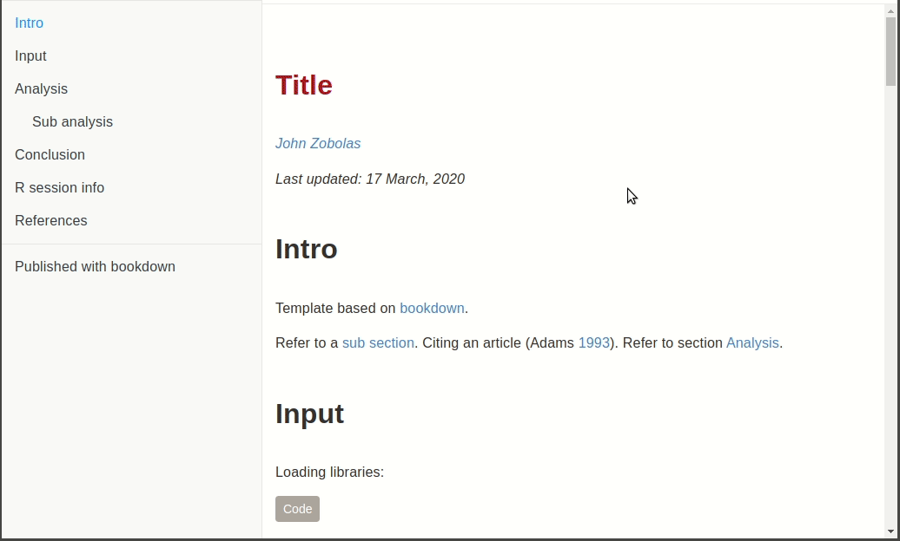

# rtemps

<!-- badges: start -->
[](https://travis-ci.com/bblodfon/rtemps)
[](https://cran.r-project.org/package=rtemps)
[](https://cran.r-project.org/package=rtemps)
<!-- badges: end -->

My personal favourite `R` templates for doing reproducible data analyses.

## Available Themes

- [United HTML Document](https://bootswatch.com/united/): a bootstrap-based single [R Markdown](https://bookdown.org/yihui/rmarkdown/) document


- [Bookdown Lite](https://bookdown.org/yihui/bookdown/): a single-paged [gitbook-based](https://www.gitbook.com/) document



## Install

From CRAN:
```r
install.packages("rtemps")
```

Note that the package imports among others the libraries [DT](https://rstudio.github.io/DT/), [ggplot2](https://github.com/tidyverse/ggplot2) and [xfun](https://github.com/yihui/xfun).

## Usage

Once the templates are installed, you can use them in 2 ways:

1. Within the templates in **RStudio** (highly advised - easiest way): 
  - `File` > `New File` > `R Markdown...` > `From Template` (United HTML Theme)
  - `File` > `New Project...` > `New Directory` > `Bookdown Lite project` (Bookdown Lite Theme)
2. By calling the `create_rtemp()` function which allows you to create a new directory with all the template files inside, ready to be used/rendered.

## Notes

### United HTML Theme

- To create and render the template from an R session, run:

```r
rtemps::create_rtemp(dirname = "new-dir", template = "united_html")
rmarkdown::render(input = "new-dir/index.Rmd", output_format = "html_document", output_dir = "new-dir")
```

### Bookdown Lite Theme

- To create and render the template from the command line, run:

```bash
Rscript -e "rtemps::create_rtemp(dirname = 'new-dir', template = 'bookdown_lite')"
cd new-dir
./_build.sh
```

- The output of the *Bookdown Lite* theme is placed under a `docs` directory, so that it can easily be rendered with [GitHub Pages](https://help.github.com/en/github/working-with-github-pages/configuring-a-publishing-source-for-your-github-pages-site).
- The *Bookdown Lite* can be easily converted to a **multi-paged document** by configuring the `split_by` property in the `_output.yml` template file ([check the doc](https://bookdown.org/yihui/bookdown/html.html#gitbook-style)).
